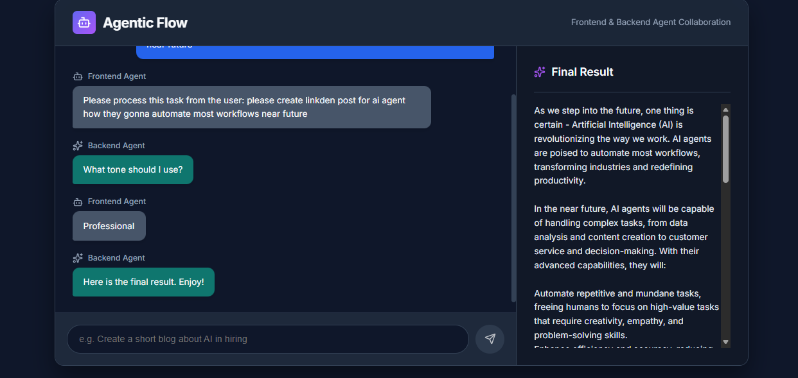
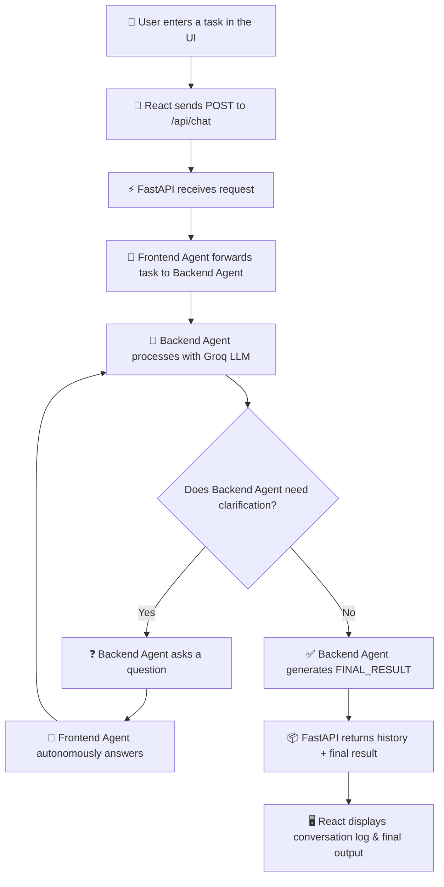

# AI Multi-Agent System

This project is a simple AI agent system where a Frontend Agent and a Backend Agent communicate with each other to complete a task. It uses React for the UI and FastAPI + LangGraph for the backend. 

# Website link 

https://cocolevio-ai-agent.onrender.com/

## Screenshot



## Features

- **Multi-Agent Interaction:** Demonstrates a LangGraph-based workflow where two agents interact autonomously to clarify a user request.
- **Frontend UI:** Built with React/Vite, featuring a clean dark mode UI with interactive elements.
- **Backend API:** Built with FastAPI, exposing an endpoint to trigger the multi-agent graph.

## System Workflow

### Architecture Overview

```
┌─────────────────────┐         HTTP POST         ┌─────────────────────────────────┐
│                     │    /api/chat {task: "..."}  │                                 │
│   React Frontend    │ ─────────────────────────▶ │   FastAPI Backend               │
│   (Vite · :5173)    │                            │   (Uvicorn · :8000)             │
│                     │ ◀───────────────────────── │                                 │
│                     │    {history, final_result}  │   ┌───────────────────────┐     │
└─────────────────────┘                            │   │   LangGraph Workflow   │     │
                                                   │   │                       │     │
                                                   │   │  ┌─────────────────┐  │     │
                                                   │   │  │ Frontend Agent  │  │     │
                                                   │   │  └────────┬────────┘  │     │
                                                   │   │           │           │     │
                                                   │   │  ┌────────▼────────┐  │     │
                                                   │   │  │ Backend Agent   │  │     │
                                                   │   │  │ (Groq LLM)     │  │     │
                                                   │   │  └─────────────────┘  │     │
                                                   │   └───────────────────────┘     │
                                                   └─────────────────────────────────┘
```

### Workflow Flowchart



### Step-by-Step Data Flow

| Step | Component | Action |
|------|-----------|--------|
| 1 | **User** | Types a task (e.g., *"Create a short blog about AI in hiring"*) and clicks Send |
| 2 | **React UI** | Sends an HTTP `POST` request to `http://localhost:8000/api/chat` with the task |
| 3 | **FastAPI** | Receives the request and initializes the LangGraph state with the user message |
| 4 | **Frontend Agent** | Wraps the user's task and passes it to the Backend Agent |
| 5 | **Backend Agent** | Reads the task, checks if it has enough info (tone, length, etc.) |
| 6 | **Backend Agent** | If info is missing → asks a clarification question back to Frontend Agent |
| 7 | **Frontend Agent** | Autonomously answers the clarification using the LLM (acts on behalf of user) |
| 8 | **Loop** | Steps 5–7 repeat until Backend Agent has all needed context |
| 9 | **Backend Agent** | Generates final content prefixed with `FINAL_RESULT:` |
| 10 | **FastAPI** | Extracts the full conversation history and final output, returns JSON |
| 11 | **React UI** | Displays the agent conversation log (left panel) and final result (right panel) |

### Key Components

- **LangGraph StateGraph** — Orchestrates the multi-agent loop with conditional routing. The `router` function decides whether to continue the conversation or end it.
- **Frontend Agent** — Acts as a proxy for the user. On the first turn it forwards the task; on subsequent turns it autonomously answers clarification questions.
- **Backend Agent** — The worker agent powered by **Groq's Llama 3.3 70B** model. It either asks for more details or produces the final output.
- **Router** — A conditional edge function that checks if `final_output` is set (→ end) or routes messages between the two agents based on who spoke last.

### Tech Stack

| Layer | Technology |
|-------|------------|
| Frontend | React 19 · Vite 6 · Axios · Lucide Icons |
| Backend | FastAPI · Uvicorn · LangGraph · LangChain |
| LLM Provider | Groq (Llama 3.3 70B Versatile) |
| Communication | REST API (JSON over HTTP) |

---

## Quick Start

Double-click **`run.bat`** at the project root to automatically start both servers and open the app in your browser. It will:
1. Activate the Python virtual environment (creates one if missing)
2. Start the FastAPI backend on **port 8000**
3. Install npm dependencies if needed and start the Vite dev server on **port 5173**
4. Open `http://localhost:5173` in your default browser

---

## Setup Instructions

### Prerequisites
- Node.js (v18+)
- Python (3.10+)
- A Groq API key (`GROQ_API_KEY` in the `.env` file)

### Backend Setup

1. Open a terminal and navigate to the `backend` directory.
   ```bash
   cd backend
   ```
2. Create and activate a virtual environment.
   ```bash
   python -m venv venv
   # Windows
   .\venv\Scripts\activate
   # Mac/Linux
   source venv/bin/activate
   ```
3. Install the dependencies.
   ```bash
   pip install fastapi uvicorn langgraph langchain-groq python-dotenv pydantic
   ```
4. Start the FastAPI server.
   ```bash
   uvicorn main:app --host 0.0.0.0 --port 8000 --reload
   ```

### Frontend Setup

1. Open a new terminal and navigate to the `frontend` directory.
   ```bash
   cd frontend
   ```
2. Install the dependencies.
   ```bash
   npm install
   ```
3. Start the development server.
   ```bash
   npm run dev
   ```

### Usage

1. Open your browser and navigate to the frontend URL (usually `http://localhost:5173`).
2. Type a task into the input box (e.g., "Create a short blog about AI in hiring").
3. Watch the interaction log as the Frontend Agent and Backend Agent communicate. The backend will ask for clarification, and the frontend will automatically provide it based on the context.
4. The final result will be displayed on the right side of the screen once the agents have finished their task.
